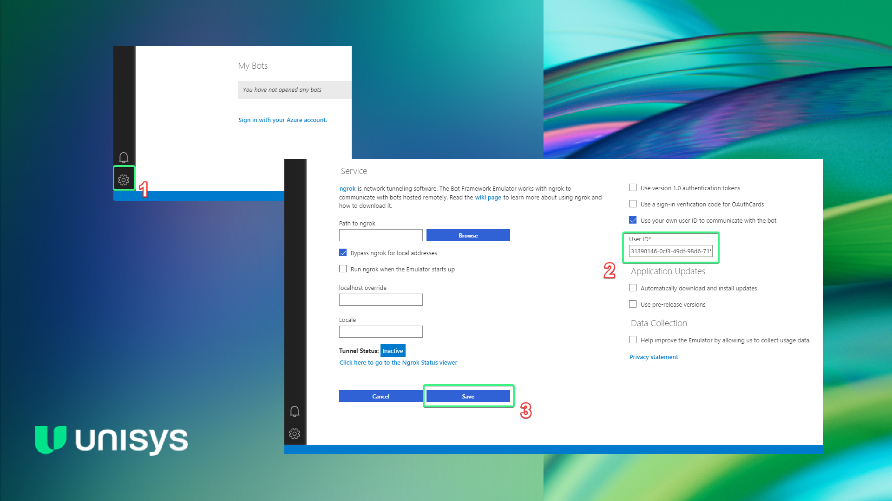

# Test.Bot

This bot has been created using [Bot Framework](https://dev.botframework.com), it:

- Implements a multi-turn conversation using Dialogs
- Handles user interruptions for such commands as `Help` or `Cancel`

## Prerequisites

### Install .NET

  [.NET SDK](https://dotnet.microsoft.com/download) 8

  ```bash
  # determine dotnet version
  dotnet --version
  ```

### Install Bot Framework Emulator

[Bot Framework Emulator](https://github.com/microsoft/botframework-emulator) is a desktop application that allows bot developers to test and debug their bots on localhost or running remotely through a tunnel.

Install the Bot Framework Emulator version 4.9.0 or greater from [here](https://github.com/Microsoft/BotFramework-Emulator/releases)

## To run this

```bash
# run the bot
dotnet run --project Test.Bot.Api.csproj
```

## Testing the bot using Bot Framework Emulator

### Connect to the bot using Bot Framework Emulator

- Launch Bot Framework Emulator
- File -> Open Bot
- Enter a Bot URL of `http://localhost:3978/api/messages`
- Repeatable testing with the same user can be achieved by configuring `User ID` in the emulator settings:



## Further reading

- [Bot Framework Documentation](https://docs.botframework.com)
- [Bot Basics](https://docs.microsoft.com/azure/bot-service/bot-builder-basics?view=azure-bot-service-4.0)
- [Dialogs](https://docs.microsoft.com/en-us/azure/bot-service/bot-builder-concept-dialog?view=azure-bot-service-4.0)