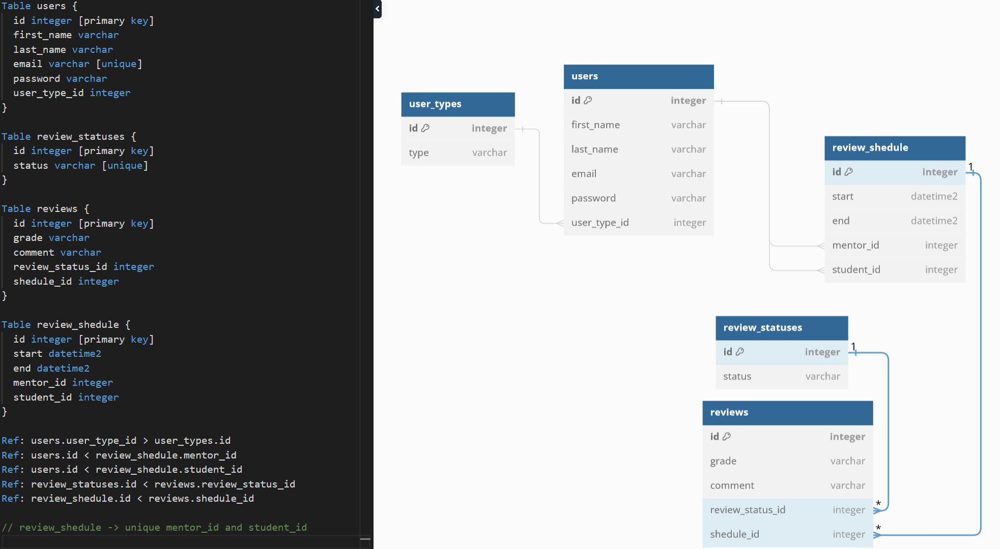

# learning-platform

# # PostgreSQL

Version 16.3.2

<b>Core user:</b> 
name - <i>admin</i> / <i>postgre</i>  
password - <i>admin123</i>  
all user passwords - <i>test123</i>  

# # Schema

# # Data

1. Data for tables -> 
    - [review_schedules](DB/review_schedules.csv)
    - [review_statuses](DB/review_statuses.csv)
    - [reviews](DB/reviews.csv)
    - [user_types](DB/user_types.csv)
    - [users](DB/users.csv)
2. Database restore [learning_platform](DB/learning_platform.sql)

# # BE RestAPI 

- Using framework [loopback 4](https://loopback.io/)
- node 22.0.0v
- `npm i` should be performed within BE folder ton install required dependencies
- `npm start` should be performed to run BE API.
- swagger can be reached at [loopback 4 swagger](http://localhost:3000/explorer/)

# # FE to use BE RestAPI

-
